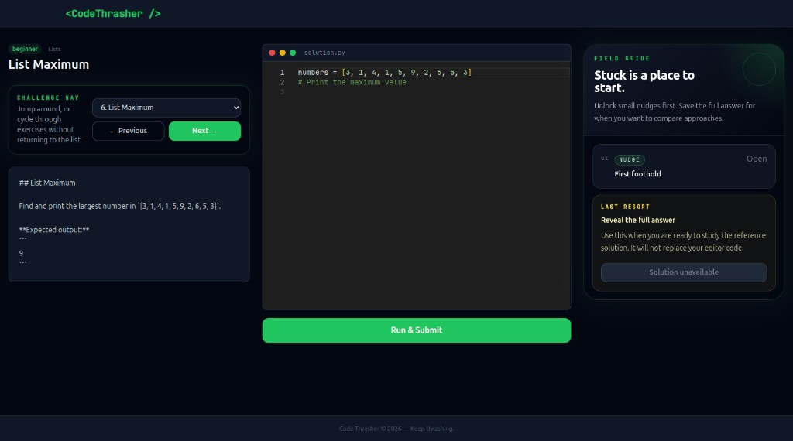

# Code-Thrasher

Code-Thrasher is a web-based platform designed to help beginners learn Python through gamified, bite-sized coding challenges.

Users register, browse exercises filtered by difficulty or category, write Python solutions in an in-browser Monaco editor, and submit them for instant automated feedback. Correct submissions earn points, building a running score and daily streak that motivate continued practice.

---



## Tech Stack

| Layer | Technology |
| --- | --- |
| Frontend | React 18, TypeScript, Vite, Tailwind CSS, Monaco Editor, Zustand |
| Backend | FastAPI (Python 3.12), SQLAlchemy 2 (async), Alembic, Pydantic v2 |
| Database | PostgreSQL 16 |
| Auth | JWT (python-jose + pbkdf2_sha256) |
| Code execution | Client Pyodide preview + server-side subprocess grading |
| Containerisation | Docker + Docker Compose |

---

## Features

- **User accounts** — register, log in, and track personal score and streak
- **Exercise library** — filterable by difficulty (`beginner`, `intermediate`, `advanced`) and category
- **In-browser code editor** — Monaco Editor with Python syntax highlighting and starter code
- **In-browser Python preview** — visible tests run in Pyodide for instant feedback; final scoring happens server-side
- **Progressive challenge guidance** — each exercise can provide staged guide cards, small snippets, and an explicit full-solution reveal
- **Automated test cases** — submissions are scored against hidden and visible test cases; partial credit is supported via per-case score weights
- **Interactive dashboard** — lists all exercises with completion status and score breakdown
- **Rate limiting** — auth, submit, solution reveal, and admin create endpoints are rate-limited via slowapi
- **Admin content controls** — exercise creation requires an admin account (`is_admin` on the user model)
- **Interactive API docs** — Swagger UI at `/api/docs`, ReDoc at `/api/redoc`

---

## Prerequisites

- [Docker](https://docs.docker.com/get-docker/) and [Docker Compose](https://docs.docker.com/compose/install/)
- [Node.js](https://nodejs.org/) 20+ and npm (for local frontend development)
- [Python](https://www.python.org/) 3.12+ and [uv](https://github.com/astral-sh/uv) (for local backend development)

---

## Quick Start (Docker)

The fastest way to run the full stack is with Docker Compose. This starts PostgreSQL, the FastAPI backend, and the built React frontend behind nginx.

```bash
# 1. Clone the repo
git clone https://github.com/your-username/Code-Thrasher.git
cd Code-Thrasher

# 2. Copy the environment file and set a strong SECRET_KEY
cp .env.example .env

# 3. Start the full app
docker compose up --build
```

Open the app at `http://localhost:8080`.

The API is also available directly at `http://localhost:8000`, and through the frontend container at `http://localhost:8080/api`. Interactive API docs are available at `http://localhost:8000/api/docs`.

Database migrations run automatically when the API container starts. To load the sample exercises on a fresh database, run this once in another terminal after the containers are up:

```bash
docker compose exec api python seed.py
```

Useful Docker commands:

```bash
docker compose ps                 # show container status
docker compose logs -f api         # follow backend logs
docker compose down                # stop containers, keep database data
docker compose down -v             # stop containers and delete database data
docker compose up --build --force-recreate
```

After changing only the frontend, rebuild and replace just the nginx/Vite image:

```bash
docker compose build --no-cache client
docker compose up -d --no-deps --force-recreate client
```

Pyodide runs in the browser via WebAssembly and is governed by the frontend Content Security Policy. If browser logs mention `wasm instantiation failed` or blocked `data:` fonts, verify the live app is serving a CSP with `'wasm-unsafe-eval'` in `script-src` and `data:` in `font-src`, then hard-refresh or clear site data for `localhost:8080`.

---

## Running on a Raspberry Pi (ARM64 / aarch64)

Code-Thrasher runs on a Raspberry Pi 4/5 without any source changes. The
`postgres:16-alpine` image is multi-arch and the API image builds Python itself,
so the `aarch64` architecture is handled automatically. Python *execution* happens
in the browser via Pyodide, so it does not load the Pi's CPU.

Two things commonly differ from a desktop setup:

- **Compose command.** Raspberry Pi OS often ships the standalone v1 binary
  `docker-compose` (hyphen) rather than the `docker compose` (space) plugin. If
  `docker compose version` fails, use `docker-compose` in every command below.
- **Permissions.** If your user is not in the `docker` group, prefix commands with
  `sudo`. To drop `sudo`, add yourself to the group once and then **log out and back
  in** (group membership does not apply to existing shells):

  ```bash
  sudo usermod -aG docker $USER   # then re-login, or run: newgrp docker
  ```

**Start the full app:**

```bash
cp .env.example .env                       # first run only; set a strong SECRET_KEY
docker-compose up --build -d               # first build takes a few minutes on a Pi
docker-compose exec api python seed.py         # first run only
```

Then open `http://<pi-ip>:8080` from any device on the LAN (or
`http://localhost:8080` on the Pi itself). The first page load downloads Pyodide
(~10 MB) in the browser, so that device needs internet access.

To stop everything: `docker-compose down` (add `-v` to also wipe the database).

---

## Local Development Setup

### Backend

```bash
cd server

# Create and activate a virtual environment
python -m venv venv
source venv/bin/activate        # Windows: venv\Scripts\activate

# Install dependencies (including dev extras)
uv pip install -e ".[dev]"

# Copy environment variables
cp ../.env.example ../.env      # edit as needed

# Start a local PostgreSQL instance (or use Docker Compose for just the db)
docker compose -f ../docker-compose.yml up db -d

# Run database migrations
alembic upgrade head

# Start the API with live reload
uvicorn app.main:app --reload
```

The API runs at `http://localhost:8000`.

### Frontend

```bash
cd client
npm install
npm run dev
```

The React app runs at `http://localhost:5173` and proxies API requests to `http://localhost:8000`.

---

## Environment Variables

Copy `.env.example` to `.env` and configure the values before running:

| Variable | Default | Description |
| --- | --- | --- |
| `POSTGRES_USER` | `codethrasher` | PostgreSQL username |
| `POSTGRES_PASSWORD` | `codethrasher` | PostgreSQL password |
| `POSTGRES_DB` | `codethrasher` | PostgreSQL database name |
| `SECRET_KEY` | *(change this)* | Secret used to sign JWTs — use a long random string in production |
| `ACCESS_TOKEN_EXPIRE_MINUTES` | `60` | JWT token lifetime in minutes |
| `ENVIRONMENT` | `development` | Runtime environment name; set to `production` only after changing `SECRET_KEY` |
| `CORS_ORIGINS` | `http://localhost:8080,http://localhost:5173` | Comma-separated allowed browser origins for direct API calls |

---

## Database Migrations

Migrations are managed with Alembic inside the `server/` directory.

```bash
# Apply all pending migrations
alembic upgrade head

# Create a new migration after changing models
alembic revision --autogenerate -m "describe your change"

# Roll back the last migration
alembic downgrade -1
```

---

## Running Tests

```bash
cd server
uv run pytest       # run all tests with coverage
uv run pytest -v    # verbose output
uv run pytest -x    # stop on first failure
uv run pytest --cov-report=html   # generate HTML coverage report in htmlcov/
```

---

## Code Quality

```bash
cd server

black .             # format code
isort .             # sort imports
flake8              # lint
mypy src/           # type check
```

---

## Project Structure

```text
Code-Thrasher/
├── client/                  # React frontend
│   ├── Dockerfile            # Builds frontend and serves it with nginx
│   ├── nginx.conf            # SPA routing and /api reverse proxy
│   └── src/
│       ├── api/             # Axios API client
│       ├── components/      # Reusable UI components
│       ├── pages/           # Route-level pages
│       ├── store/           # Zustand auth store
│       └── types/           # Shared TypeScript types
├── server/                  # FastAPI backend
│   ├── alembic/             # Database migrations
│   └── app/
│       ├── api/v1/endpoints # Route handlers (auth, exercises, submit)
│       ├── core/            # Config and JWT security
│       ├── db/              # Async SQLAlchemy session
│       ├── models/          # ORM models
│       ├── schemas/         # Pydantic request/response schemas
│       └── services/        # Sandbox execution engine
├── docker-compose.yml
├── .env.example
└── README.md
```

---

## API Reference

| Method | Path | Description |
| --- | --- | --- |
| `POST` | `/api/v1/auth/register` | Register a new user |
| `POST` | `/api/v1/auth/login` | Log in and receive a JWT |
| `GET` | `/api/v1/exercises` | List exercises (filter by `difficulty`, `category_id`) |
| `GET` | `/api/v1/exercises/{id}` | Get exercise details and visible test cases |
| `GET` | `/api/v1/exercises/{id}/solution` | Reveal the reference solution for an exercise |
| `POST` | `/api/v1/exercises` | Create an exercise (admin) |
| `POST` | `/api/v1/submit/` | Submit code for evaluation |
| `GET` | `/api/health` | Health check |

Full interactive documentation is available at `http://localhost:8000/api/docs`.

---

## Next

- Track guide and solution reveals per user once authentication is wired into exercise endpoints.

---

## License

[MIT](LICENSE)
